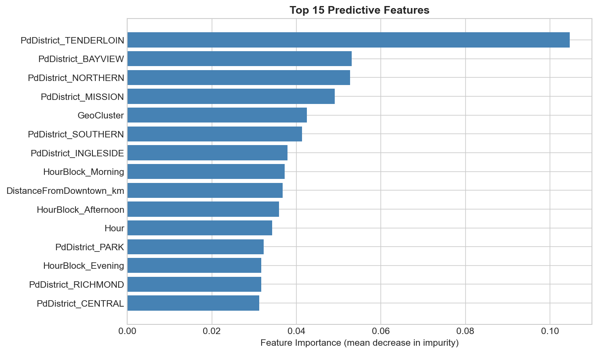
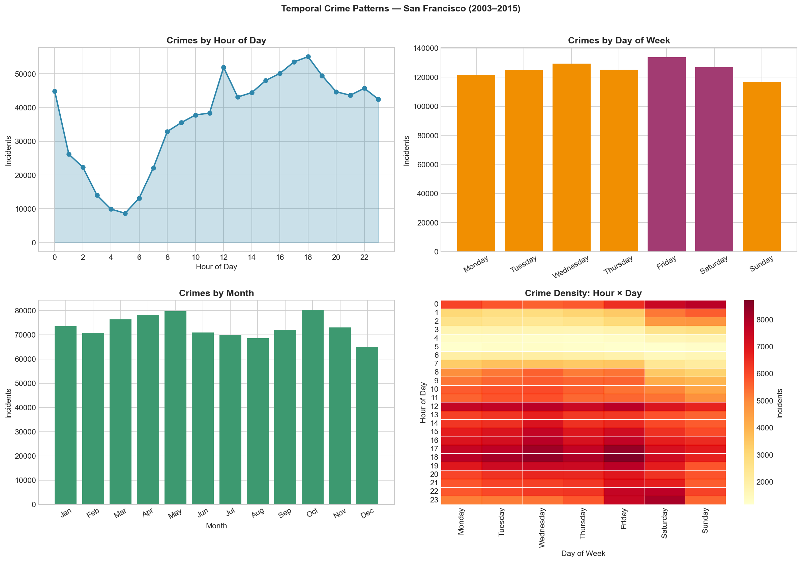

# SF Crime Category Prediction

Multiclass classification of San Francisco Police Department (SFPD) incident reports across **39 crime categories** using spatiotemporal features.

Based on the [Kaggle SF Crime Classification](https://www.kaggle.com/competitions/sf-crime) dataset — 878K labeled incidents spanning 2003–2015.

---

## Problem

Given only the information available at the moment of dispatch — **when**, **where**, and **which district** — predict the crime category.

This is a hard problem by design: 39 imbalanced classes with significant overlap in time and space. The primary metric is **multiclass log loss**, which penalises overconfident wrong predictions rather than just counting errors.

---

## Results

| Model | Accuracy | Log Loss |
|-------|----------|----------|
| **XGBoost** | **29.0%** | **2.53** |
| Logistic Regression | 22.4% | 2.59 |
| Naive Bayes | 20.4% | 2.71 |
| Random Forest | 14.9% | 3.52 |
| KNN | 15.1% | 17.28 |

XGBoost achieves the best log loss. Logistic regression is a strong and interpretable runner-up. KNN and Random Forest produce poorly calibrated probabilities, which inflates log loss despite reasonable accuracy.

> **Context:** A majority-class baseline (always predict LARCENY/THEFT) scores ~21% accuracy and log loss ~3.6. XGBoost improves log loss by ~30% over this baseline.

---

## Key Finding: Distance from Downtown Dominates

Feature importance from XGBoost reveals that `DistanceFromDowntown_km` accounts for **~63% of total importance**, far outweighing temporal features. Crime type is more a function of *where you are in the city* than *when the incident occurs* — downtown SF concentrates theft and fraud, while outlying neighbourhoods see proportionally more vehicle theft and residential burglary.



---

## Features

| Feature | Type | Description |
|---------|------|-------------|
| `DistanceFromDowntown_km` | numeric | Haversine distance from 37.7749°N, 122.4194°W |
| `GeoCluster` | numeric | KMeans cluster ID (K=15) fitted on lat/lon |
| `Hour` | numeric | Hour of incident (0–23) |
| `DayOfWeek_Num` | numeric | Day of week as integer (0=Monday) |
| `IsWeekend` | numeric | 1 if Saturday or Sunday |
| `Month` | numeric | Month of year |
| `HourBlock` | categorical | Binned hour: Late Night / Morning / Afternoon / Evening / Night |
| `Season` | categorical | Winter / Spring / Summer / Fall |
| `PdDistrict` | categorical | One of 10 SFPD police districts |
| `DayOfWeek` | categorical | Day name (for one-hot encoding) |

`Descript` and `Resolution` are excluded — they are unavailable at dispatch time or constitute label leakage.

---

## Repository Structure

```
crime-category-prediction/
│
├── README.md
├── requirements.txt
├── .gitignore
│
├── data/
│   └── README.md               # Download instructions and schema
│
├── src/
│   ├── __init__.py
│   ├── features.py             # Data cleaning and feature engineering
│   ├── evaluate.py             # Log loss / accuracy metrics and comparison table
│   └── visualize.py            # EDA and results plots
│
├── notebooks/
│   └── analysis.ipynb          # End-to-end narrative analysis
│
├── scripts/
│   └── train.py                # CLI training pipeline
│
└── outputs/
    └── figures/                # Saved plots (crime distribution, temporal patterns, etc.)
```

---

## Quickstart

```bash
# 1. Clone and install
git clone https://github.com/<your-username>/crime-category-prediction.git
cd crime-category-prediction
pip install -r requirements.txt

# 2. Download data (Kaggle CLI)
kaggle competitions download -c sf-crime -p data/
unzip data/train.csv.zip -d data/

# 3. Run full training pipeline
python scripts/train.py

# 4. Or open the notebook
jupyter notebook notebooks/analysis.ipynb
```

**CLI options:**
```bash
python scripts/train.py --sample 50000   # subsample training set (default)
python scripts/train.py --sample 0       # full 878K dataset (slower)
python scripts/train.py --model xgboost  # single model
```

---

## EDA Highlights

**Crime volume by hour** — peaks at 17:00–18:00, trough at 5:00 AM.
**Weekly pattern** — Friday and Saturday have ~15% more incidents than midweek.
**District variation** — Tenderloin concentrates drug and prostitution; Southern district leads in theft.



---

## Possible Improvements

- **Address-level encoding:** Street intersections carry strong priors (e.g., 6th & Market vs Great Highway).
- **Year-over-year trend features:** Capture gentrification-driven shifts in crime geography over the 12-year span.
- **Richer spatial encoding:** Replace KMeans clusters with census tract or neighbourhood boundary joins via geopandas.
- **Probability calibration:** Post-hoc Platt scaling or isotonic regression would reduce log loss without changing predictions.
- **Gradient boosting tuning:** Optuna/Hyperopt search over XGBoost hyperparameters has room to push log loss below 2.4.

---

## Tech Stack

- **Python 3.10+**
- **scikit-learn** — preprocessing pipelines, Logistic Regression, Random Forest, KNN, Naive Bayes
- **XGBoost** — gradient boosting classifier
- **pandas / NumPy** — data manipulation
- **matplotlib / seaborn** — visualisation
